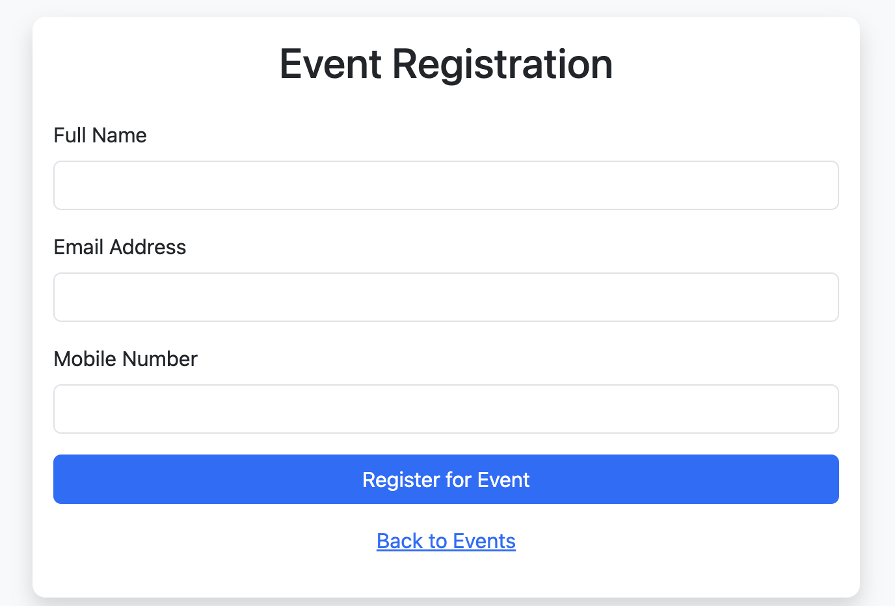
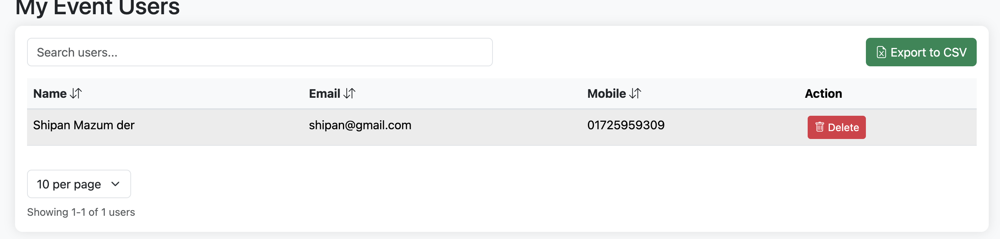

# Event Management System

A comprehensive web-based event management system built with PHP that allows organizations to create, manage, and track events and registrations.

## Features

- **Event Management**
  - Create and edit events
  - View all events in an organized layout
  - Track event details and registrations

- **Public Event Listing**
  - Browse all events without registration
  - View event details and information
  - Simple event registration process

- **Registration System**
  - User-friendly event registration form
  - Ajax-based form submission
  - Registration tracking

- **Event Administration**
  - Manage event registrations
  - View registered participants
  - Export registration data

## Installation

1. **Prerequisites**
   - PHP 7.0 or higher
   - MySQL 5.6 or higher
   - Apache Web Server
   - XAMPP (for local development)

2. **Local Development Setup**

   a. Clone the repository to your web server directory:
   ```bash
   git clone https://github.com/shipanmazumder/event-managment.git
   ```

   b. Configure your database:
   - Create a new MySQL database
   - Import the database schema (if provided)
   - Update database credentials in `config/config.php`

   c. Configure Apache:
   - Ensure mod_rewrite is enabled
   - Set appropriate permissions for directories

3. **Shared Hosting Installation**
   
   a. Upload files:
   - Upload all files to your hosting directory (usually public_html or www)
   - Ensure proper file permissions (755 for directories, 644 for files)

   b. Database setup:
   - Create a new MySQL database through hosting control panel
   - Import the database schema
   - Need mysqli enabled
   - Update database credentials in `config/config.php`
      ```
      <?php
         define("DB_HOST","localhost");
         define("DB_USER","root");
         define("DB_PASS","your password");
         define("DB_NAME","events");
         define("TITLE","Event Management System");
         define("KEYWORDS","Event Management System");
      ?>
      ```

   c. Configure domain/subdomain:
   - Point your domain/subdomain to the installation directory

4. **Directory Structure**
   ```
   events/
   ├── class/          # PHP classes
   ├── config/         # Configuration files
   ├── css/            # Stylesheets
   ├── helpers/        # Helper functions
   ├── inc/            # Include files
   ├── js/             # JavaScript files
   └── lib/            # Core libraries
   └── screenshot/     # Screenshots
   └── sql/            # SQL
   ```

## Available Routes

### Public Routes
- `/events.php` - List all available events
- `/register-event.php?id={event_id}` - Event registration form
- `/register.php` - Create new account
- `/login.php` - Login page

### Admin Routes
- `/create-event.php` - Create new event
- `/edit-event.php?id={event_id}` - Edit existing event
- `/event-users.php` - View all registered users
- `/export.php` - Export event data
- `/user-export.php` - Export user registration data

### API Routes
- `/register-event-ajax.php` - Handle event registration (AJAX)
- `/get-event-details.php` - Get event details (AJAX)

## Test Credentials

For testing purposes, you can use the following login credentials:

1. Admin User
   ```
   Email: admin@admin.com
   Password: Admin@1234
   ```

## Usage

1. Viewing Events:
   - Access events.php to browse all available events
   - No registration required to view events
   - View detailed event information

2. Event Registration:
   - Select an event of interest
   - Fill out the registration form
   - Receive confirmation of registration

3. Event Management:
   - Login to admin panel
   - Create and manage events
   - Track registrations
   - Export participant data

## Security

- Implements session-based authentication
- SQL injection prevention

## Contributing

1. Fork the repository
2. Create your feature branch
3. Commit your changes
4. Push to the branch
5. Create a new Pull Request

## System Screenshots

### Database Structure

- Complete database schema
- Tables and relationships
- Field definitions

### Public Event Pages

- Public listing of all upcoming events
- Event details with date, time, and location
- Registration availability status

### Event Registration

- User-friendly registration form
- Essential participant information collection
- Simple and intuitive interface

### Admin Interface

- Secure admin access portal
- Authentication system


- Event creation interface
- Comprehensive event details form
- Date and time management

### User Management

- Registered participants list
- User information management
- Registration tracking

### Account Management

- Account creation interface
- New user registration form

## License

This project is licensed under the MIT License - see the LICENSE file for details.
